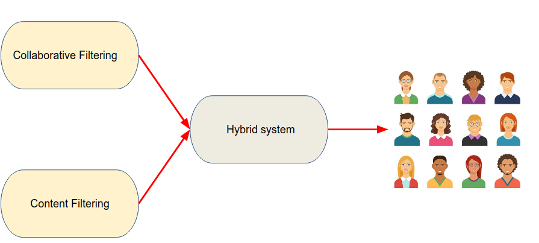
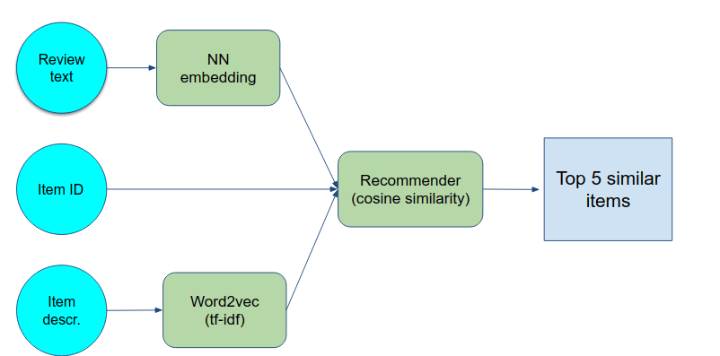
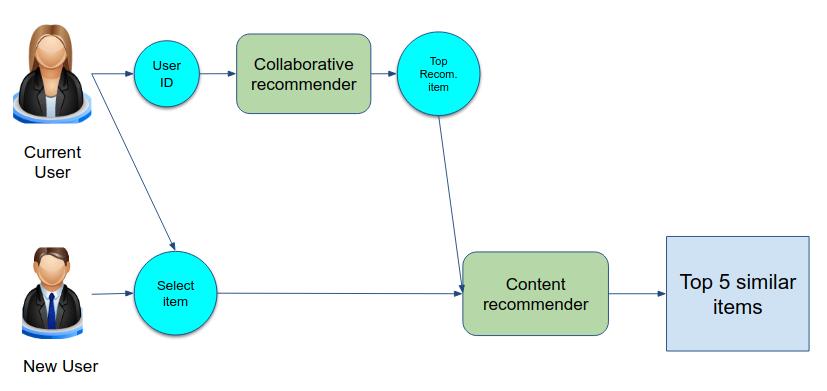
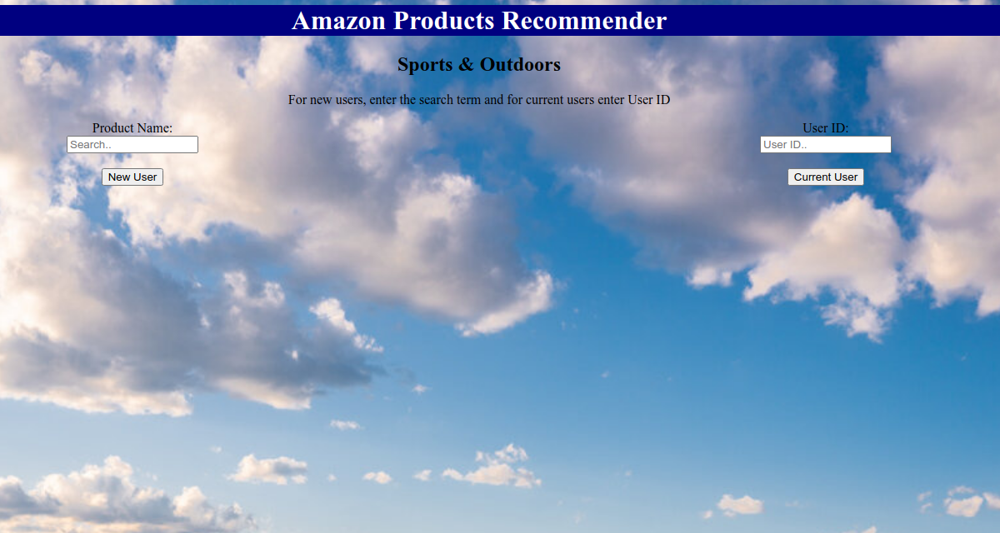

# Developing a hybrid recommender system for Amazon products: Sports & Outdoors

 
 In recent decades, many web services such as Netflix, Youtube, Amazon, and other companies  implemented systems to suggest relevant products to their users. Content and collaborative recommenders are among the most popular methods for many web services.

These recommenders, however, have their drawbacks. For example, the collaborative filters are not working well to suggest new items to users. Though the context filters can better handle the cold start problem, these filters can only recommend an item whenever there are other items with features similar to the new one. To address the mentioned limitations, I developed a hybrid recommendation system.

To achieve the main goal of this project, I used a cloud based computing system (i.e., AWS, ec2) to analyze an [Amazon review dataset](https://nijianmo.github.io/amazon/index.html). This dataset includes reviews (ratings, text, helpfulness votes) of different product categories such as Amazon fashion, beauty, books, electronics, etc. Here, I mainly focused on Sport & outdoors category. This dataset includes reviews (ratings, text, helpfulness votes), product metadata (e.g., product information: color , size (large or small), package type; and Product images that are taken after the user received the product), and links.

As mentioned above, to develop a recommender system, I combined two systems: collaborative and recommender systems. In the content system (Fig. 1), I used embedding neural networks to extract features of the review text. I also vectorized items text by using tfidf method. Finally, I combined these features and measured cosin similarity matrix to find similar items. your-text-here 

Fig 1. The content based recommender system. </em>

For the collaborative system, I used Surprise module and the non-negative matrix factorization algorithm to extract latent features. I used these features to find top items for a given user based on his/her previous ratings.

In the hybrid algorithm (Fig. 2), the collaborative filter extracts a top item that a user may like. Then, the content-based system finds similar items to the item that the collaborative suggested. 

Fig 3. The proposed hybrid recommender system. </em>

I deployed the hybrid system in an AWS ec2 instance ( Fig. 3. Also, see the live app [here](http://ec2-3-231-22-61.compute-1.amazonaws.com:8080/)). For furthure information, please refer to the related slides ([here](Slides/Amazon_recommenders.pdf))

Fig 2. A screenshot of the deployed product. </em>

## Tech used:
**Data Science:** Natural Language Processing, Deep learning, Classification, Clustering

**Tools:** ANN, NLP, Non-negative matrix factorization

**Programming:** Python (Pandas, Numpy, Scikit-Learn, Matplotlib, Surprise, Flask)
Big Data: AWS (EC2, S3)
